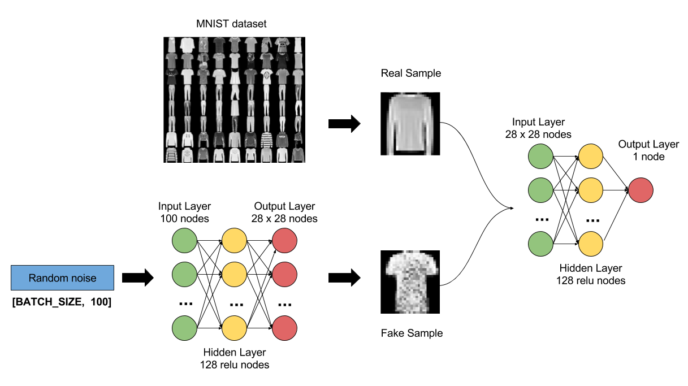
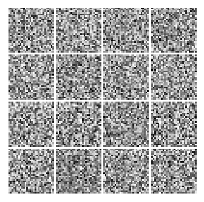
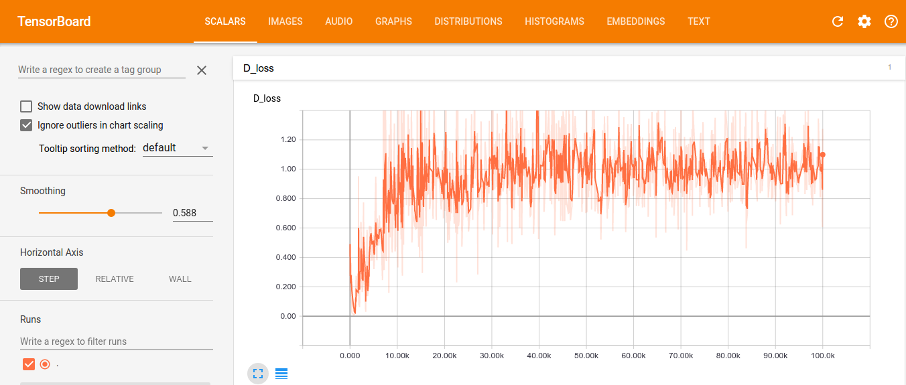
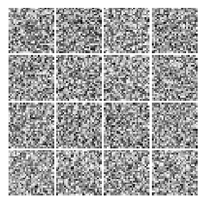
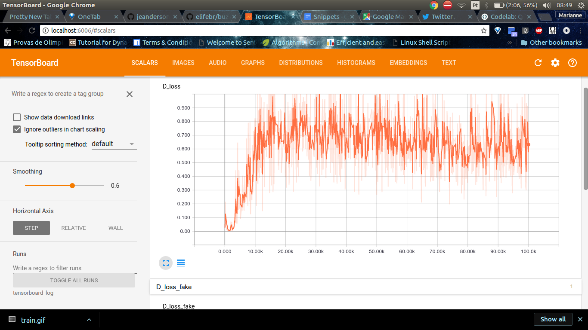
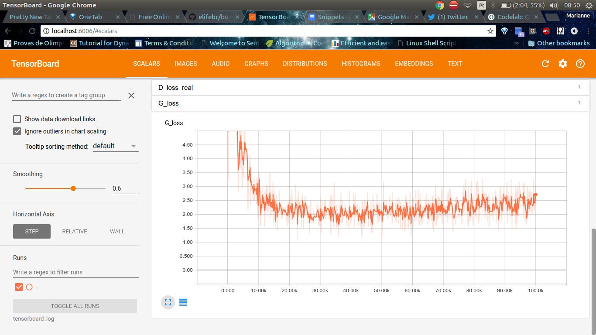

# Vanilla GAN for Fashion MNIST or classic MNIST

GANs are a very hot topic in the Deep Learning world! The goal of this implementation is to
have a simple and fun demo, of a simple GAN that you can train in a few minutes but still
getting some cool results!



[Want to learn more about GANs ?](https://github.com/mari-linhares/DeepLearning#gans)

The code is basically the same available [here](https://github.com/wiseodd/generative-models/blob/master/GAN/vanilla_gan/gan_tensorflow.py)
by  @wiseodd, that has a great repo with a lot of GAN implementations
and a great [blog post](http://wiseodd.github.io/techblog/2016/09/17/gan-tensorflow/)
about this vanilla implementation.

I've changed this code mainly in order to make it simpler for
beginners to get started with GANs and TensorFlow.

I've also implemented other features as:

* TensorBoard visualization for the discriminator and
  generator losses;
* Downloading the fashion mnist and classic mnist datasets
  automatically;
* Added comments and refactored code to make it simpler.

Looking for better generated samples? Here is a code for a
[DCGAN](https://github.com/carpedm20/DCGAN-tensorflow) by @carpedm20.
It will take a lot more time to train, but it will generate better results.

## How to run?

### Install

* [TensorFlow](https://www.tensorflow.org/install/)
* [Matplotlib](https://matplotlib.org/)

### Run

Run fashion MNIST:

```bash
python gan.py
```

run classic MNIST:

```bash
python gan.py --mnist=mnist
```

There are some arguments you can play with, to check all of them
run:

```bash
python gan.py -h
```

You'll see something like:

```
usage: gan.py [-h] [--output_path OUTPUT_PATH] [--input_path INPUT_PATH]
              [--log_path LOG_PATH] [--mnist MNIST] [--z_dim Z_DIM]
              [--batch_size BATCH_SIZE] [--train_steps TRAIN_STEPS]

optional arguments:
  -h, --help            show this help message and exit
  --output_path OUTPUT_PATH
                        Output path for the generated images.
  --input_path INPUT_PATH
                        Input path for the fashion mnist.If not available data
                        will be downloaded.
  --log_path LOG_PATH   Log path for tensorboard.
  --mnist MNIST         Choose to use "fashion" (fashion-mnist) or "mnist"
                        (classic mnist) dataset.
  --z_dim Z_DIM         Output path for the generated images.
  --batch_size BATCH_SIZE
                        Batch size used for training.
  --train_steps TRAIN_STEPS
                        Number of steps used for training.
```

## Check tensorboard

```bash
# tensorboard_log is the default path to tensorboard logs
tensorboard --logdir=tensorboad_log

# a more general command is
tensorboard --logdir=<the value of --log_path>
```

## Training example

### Fashion MNIST



## Discriminator Loss



## Generator Loss


### Classic  MNIST



## Discriminator Loss



## Generator Loss


